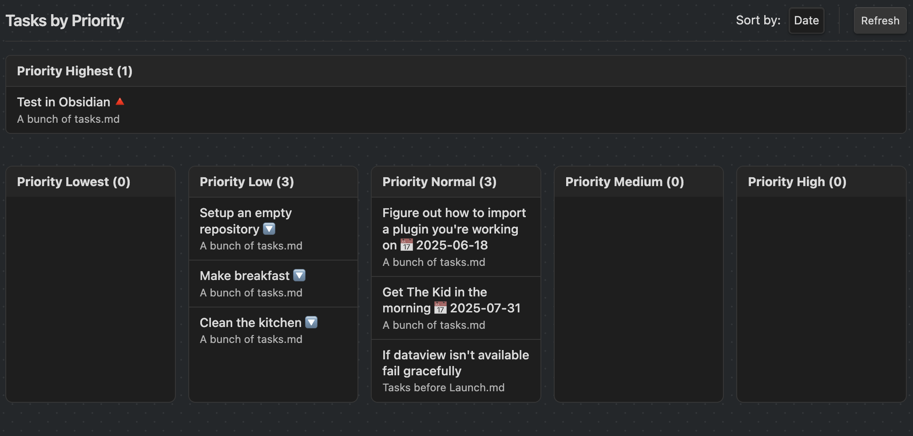

# Task Prioritizer Plugin

A plugin for Obsidian that helps you view, sort, and manage your tasks by priority, leveraging the Dataview and Tasks plugins for advanced task management.

## Features

-   Displays all your tasks grouped by priority (Highest, High, Medium, Normal, Low, Lowest)
-   Drag and drop tasks between priority groups to change their priority
-   Sort tasks by date, file, or text
-   Customizable Dataview query to filter which tasks are shown
-   Ribbon icon and command to open the Task Priorities view
-   Option to open the view as a full page or in the right sidebar
-   Click a task's file info to jump to its location in your vault
-   (If the Tasks plugin is installed) Edit tasks directly from the view
-   Dot matrix background and modern UI

## Requirements

-   [Dataview plugin](https://github.com/blacksmithgu/obsidian-dataview) (required)
-   [Tasks plugin](https://github.com/obsidian-tasks-group/obsidian-tasks) (optional, for task editing)

## Getting Started

1. Install the Dataview plugin from the Obsidian community plugins directory.
2. (Optional) Install the Tasks plugin for advanced task editing.
3. Copy `main.js`, `styles.css`, and `manifest.json` to your vault's `.obsidian/plugins/tasks-prioritizer/` folder.
4. Enable the plugin in Obsidian settings.
5. Use the ribbon icon or command palette to open the Task Priorities view.

## Settings

-   **Default Sort:** Choose how tasks are sorted (date, file, or text)
-   **Refresh Interval:** How often to refresh tasks automatically (in seconds)
-   **Open View Full Size:** Open the view as a full page or in the right sidebar
-   **Task Query:** Dataview query to filter which tasks are shown (default: `TASK WHERE !completed AND !checked`)

## Development

-   Clone this repo or copy the files to your plugin folder.
-   Run `npm i` to install dependencies.
-   Run `npm run dev` to start compilation in watch mode.
-   Edit `claude/main.ts` and `claude/styles.css` as needed.

## Releasing

-   Update `manifest.json` with your new version number and minimum Obsidian version.
-   Create a new GitHub release and upload `manifest.json`, `main.js`, and `styles.css`.

## API Documentation

There is no exposed API for this plugin.
